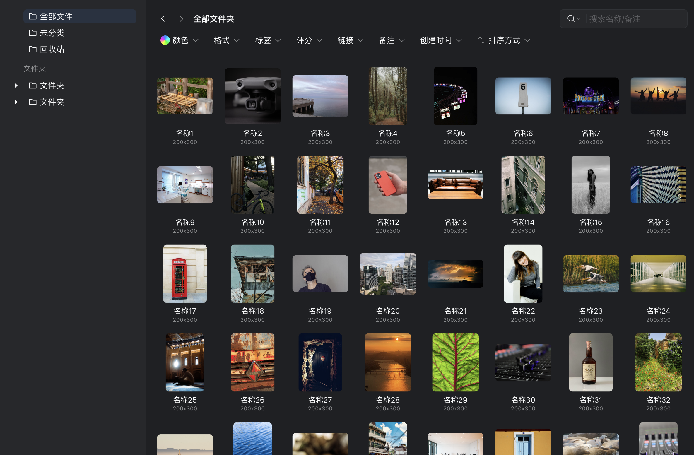

# LemSpace
素材管理工具(类似Eagle,pixcall,billfish)


### 开发框架
tauri(vue3 + rust)

### 类似效果图


## 开发记录
```2023/12/14```



```2023/12/16```
- 完善一级素材展示及部分功能
- 新增浅色界面
  


```2023/12/18```
- 新增设置/主题切换


```2023/12/25```
- 新增素材虚拟列表，以及数据瀑布流布局


